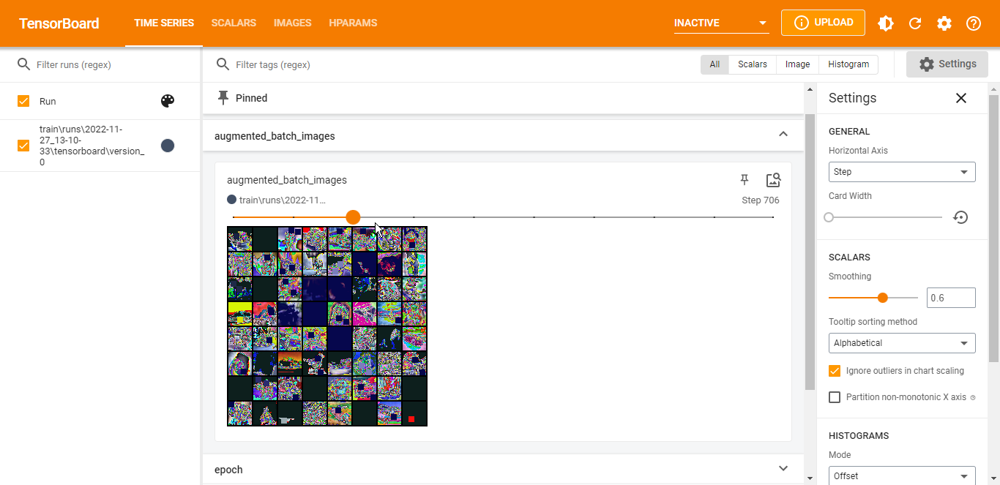
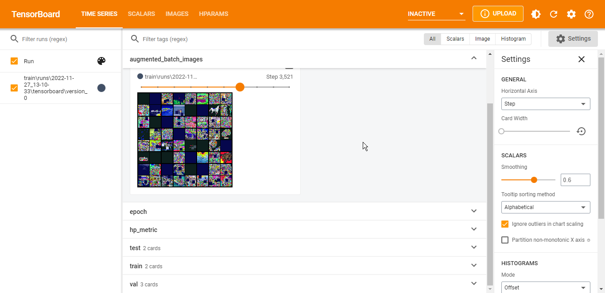
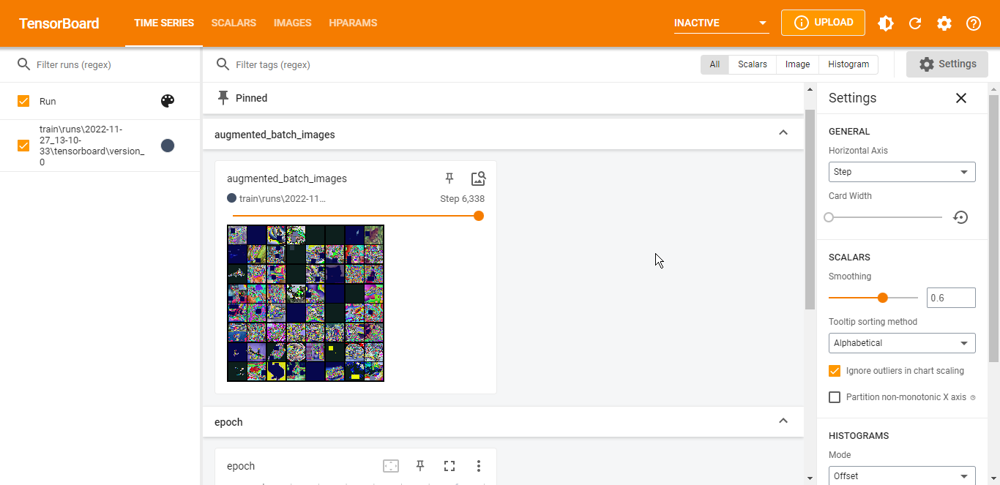

<h1 style="text-align:center">Drift Drift Drift !!</h1>

# TOC
- [TOC](#toc)
- [Assignment](#assignment)
- [Solution](#solution)
  - [Data Drift](#data-drift)
  - [Maximum Mean Discrepancy (MMD)](#maximum-mean-discrepancy-mmd)

# Assignment
 
1. Use Albumentations for perturbations in test CIFAR10 and check for drift
2. Train the CIFAR10 model with all sorts of augmentations
   1. Check for drift by same perturbations on the test dataset you made in 1.
3. Plot 25 samples of your augmentations while training (every epoch) to tensorboard
4. Submit the tensorboard logs for the augmented dataset training
5. Write the drift test results to a README.md Links to an external site.file
6. Submit link to github with above changes

# Solution

- Perturbations used [check script to calculate drift](src/drift.py) [config file](configs/drift.yaml)
    ```python
    A.Compose(
        [
            A.Rotate(limit=5, interpolation=1, border_mode=4),
            A.HorizontalFlip(),
            A.CoarseDropout(2, 8, 8, 1, 8, 8),
            A.RandomBrightnessContrast(brightness_limit=1.5, contrast_limit=0.9),
            ToTensorV2(),
        ]
    )
    ```
- `python sec/drift.py` 
    ```bash
    {'data': {'is_drift': 1,
            'distance': 0.0016843080520629883,
            'p_val': 0.0,
            'threshold': 0.05,
            'distance_threshold': array(0.00044209, dtype=float32)},
    'meta': {'name': 'MMDDriftTorch',
            'online': False,
            'data_type': None,
            'version': '0.10.4',
            'detector_type': 'drift',
            'backend': 'pytorch'}}
    ```

- [data loader with augmentations](src/datamodules/cifar_datamodule.py) model was trained for 10 epochs with these augmentaion
    ```bash
    ┏━━━━━━━━━━━━━━━━━━━━━━━━━━┳━━━━━━━━━━━━━━━━━━━━━━━━━━━┓
    ┃        Test metric     ┃       DataLoader 0      ┃
    ┡━━━━━━━━━━━━━━━━━━━━━━━━━━╇━━━━━━━━━━━━━━━━━━━━━━━━━━━┩
    │         test/acc       │    0.7929999828338623   │
    │         test/loss      │    0.6434506177902222   │
    └──────────────────────────┴───────────────────────────┘
    ```

- results after training 
    ```bash
    {'data': {'is_drift': 0,
          'distance': 0.0006045103073120117,
          'p_val': 0.1599999964237213,
          'threshold': 0.05,
          'distance_threshold': array(0.00157744, dtype=float32)},
    'meta': {'name': 'MMDDriftTorch',
            'online': False,
            'data_type': None,
            'version': '0.10.4',
            'detector_type': 'drift',
            'backend': 'pytorch'}}
    ```

- [tensorboard logs](https://tensorboard.dev/experiment/OF8EVONsQimcQXRAiRPfkg)





log images in tensorboard
```python
def training_step(self, batch: Any, batch_idx: int):
      loss, preds, targets = self.step(batch)
      self.ne += 1
      # update and log metrics
      self.train_loss(loss)
      self.train_acc(preds, targets)

      if batch_idx in (0, 1):
          grid = torchvision.utils.make_grid(batch[0])
          self.logger.experiment.add_image("augmented_batch_images", grid, self.ne)
```
Maximum Mean Discrepancy (MMD) is used to calculate data drift

## Data Drift
-----
A predictive ML model learns theta to output P(Y|X; theta).

Data drift is when P(X) changes: different data distributions, different feature space.

Ex: service launched in a new country, expected features becoming NaNs.

## Maximum Mean Discrepancy (MMD)
----

 

$MMD(F, p, q) = ||\mu_p-\mu_q||^2_{F}$

 

Maximum mean discrepancy (MMD) is a statistical test used to determine whether given two distribution are the same which is proposed in.

Or in more simpler terms

MMD is a distance (difference) between feature means

All we are trying to do is compare distributions !

MMD is very commonly used in GANs to check how good of images that GAN produces with respect to the input dataset that it was trained on: https://www.onurtunali.com/ml/2019/03/08/maximum-mean-discrepancy-in-machine-learning.html

 

HANDS ON

 

MMD as loss function: https://github.com/ZongxianLee/MMD_Loss.Pytorch/blob/master/mmd_loss.py

https://en.wikipedia.org/wiki/Permutation_test

 

 

How is the p-value calculated?

Assume we have two distributions X1 and X2. We approximate sampling from the null-hypothesis by shuffling between the two distributions X1 and X2, so that both sample inputs come from the same distribution. If the sample is sufficiently large we can compute the thresholds just on that.

Now the p-value to our observation is ( MMD_ref < MMD_sampled ) mean

More on MMD: https://github.com/TorchDrift/TorchDrift/blob/master/notebooks/note_on_mmd.ipynb
