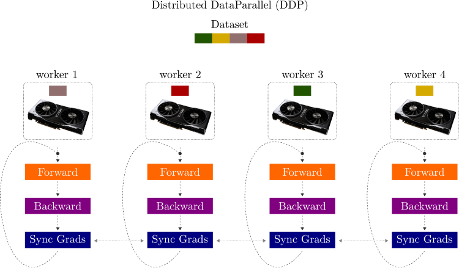
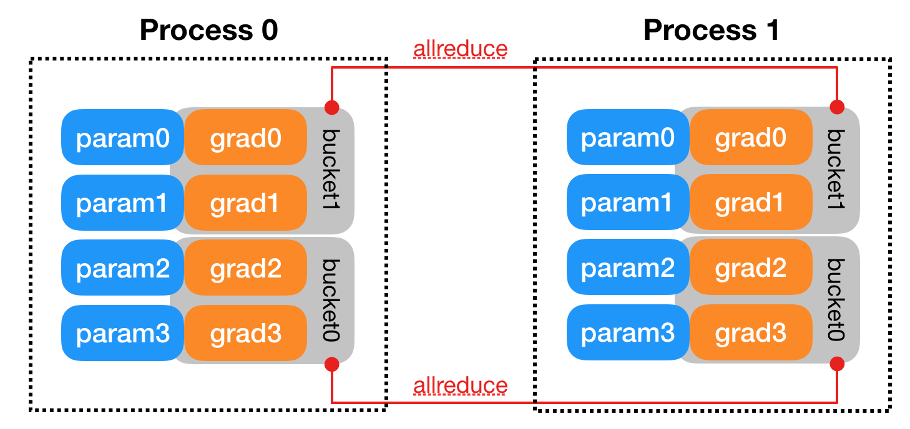
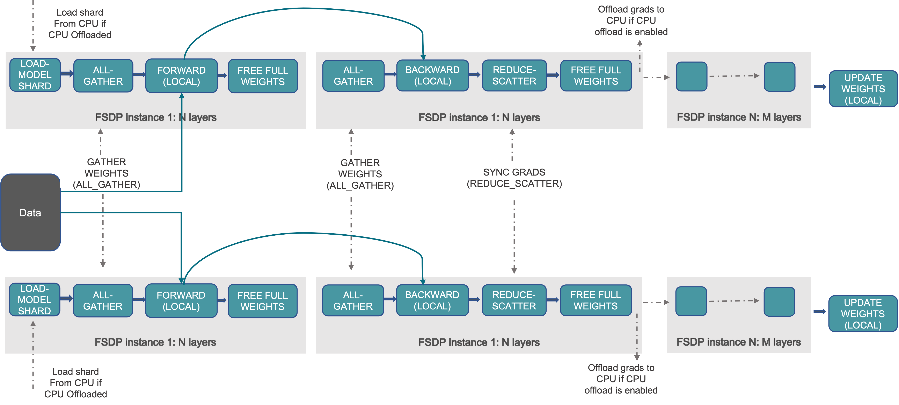

# Assignment 
- Model: timm.create_model("vit_base_patch32_224", pretrained=True)

- Dataset: CIFAR10

- Epochs: >25

- Train ViT Base using FSDP (4 GPU)
- Train ViT Base using DDP (4 GPU x 2 Nodes)
- Use the highest batch_size possible for both strategies
- Store the best checkpoint of both to AWS S3
- In your repository add a training log book folder and create a .md file for above experiments
- Add Model Validation Metrics, Training Time, GPU memory usage, GPU Utilization (nvidia-smi dump) for both strategies
- you can run the testing script after training the model to get the final model metrics
- Add the maximum batch_size number you were able to achieve
Upload Tensorboard logs to Tensorboard.dev and add link to it
- All the above MUST be in a github repository markdown file
- Submit the link to the markdown file in the github repository
- Update (22-Oct-2022):
- Since it's difficult as of now to get access to multi GPU systems, the assignment can be done with multi node, each node with single GPU, so you can do it with 4 x g4dn.xlarge or even 8 x g4dn.xlarge, so in total you get 4/8 GPUs.
- FSDP can also be done using above (5 epochs should be fine)
You can simulate DDP using CPU, see configs/trainer/ddp_sim.yaml, and once everything works, you can move to multi node gpu training.
- Deadline is extended by a week
- Bonus Assignment
- Train ViT Base or larger model using HiveMind
- You'll need to integrate PyTorch Lightning template to - HiveMind: https://pytorch-lightning.readthedocs.io/en/stable/strategies/hivemind_basic.htmlLinks to an external site.
- Log Validation Metrics to Tensorboard
- You can work as a team, use Colab, Kaggle, AWS anything!
- Highest Epochs and Highest Accuracy = Highest additional points
- Write the Model Validation Metrics, total trained time, and total epochs in the markdown file
Upload Tensorboard logs to Tensorboard.dev and add link to it

# Solution

- DDP-MASTER node logs Tensorboard kink - https://tensorboard.dev/experiment/u4RTqta6QeyGGWYrxnqpJw/#scalars
- DDP-SLAVE node logs Tensorboard link - https://tensorboard.dev/experiment/u4RTqta6QeyGGWYrxnqpJw/

- FSDP-MASTER node logs Tensorboard link - https://tensorboard.dev/experiment/zyMlx09jRKKfDFB9uZNuyw/#scalars

- [Gpu logs for ddp](./GPU_LOGS_ddp.txt)
- [Gpu logs for fsdp](./GPU_LOGS_fsdp.txt)

# Distributed Training

## Model and Data Parallelism

 (DP) splits a batch across k GPUs. That is, if you have a batch of 32 and use DP with 2 gpus, each GPU will process 16 samples, after which the root node will aggregate the results.

```bash

from torch.nn import DataParallel as DP

wrapped_model = DP(model)
```
Pytorch provides two settings for distributed training: `torch.nn.DataParallel` (DP) and `torch.nn.parallel.DistributedDataParallel` (DDP), where the latter is [officially recommended](https://pytorch.org/tutorials/intermediate/ddp_tutorial.html?highlight=distributed). In short, DDP is faster, more flexible than DP.

The fundamental thing DDP does is to copy the model to multiple gpus, gather the gradients from them, average the gradients to update the model, then synchronize the model over all K processes.

DP accumulates gradients to the same `.grad` field, while DDP first use `all_reduce` to calculate the gradient sum across all processes and divide that by `world_size` to compute the mean.

## Distributed DataParallel



1. Each GPU across each node gets its own process.
2. Each GPU gets visibility into a subset of the overall dataset. It will only ever see that subset.
3. Each process inits the model.
4. Each process performs a full forward and backward pass in parallel.
5. The gradients are synced and averaged across all processes.
6. Each process updates its optimizer.

```bash
from torch.nn.parallel import DistributedDataParallel as DDP

wrapped_model = DDP(model)
```
[How gradients are applied in the backward pass](https://pytorch.org/docs/stable/notes/ddp.html)




# Multi Node Training (Cluster)

HandsOn Multi Node Training

 We’ll use the PyTorch Lightning template we’ve been using since

 Spin up 2 GPU Spot Instance

 Modify the Security Group to allow all ports inbound traffic

 Make sure to select Deep Learning AMI with PyTorch 1.12+

 Connect over SSH to both of the instances

 DeepLearning AMI is setup with PyTorch in a conda environment

 ```bash
 source activate pytorch
```
Now setup training repository in both the instances (PyTorch Lightning Template)

- Master Node

```bash
MASTER_PORT=29500 MASTER_ADDR=172.31.10.234 WORLD_SIZE=2 NODE_RANK=0 python src/train.py trainer=ddp trainer.devices=1 trainer.num_nodes=2
```
- Worker Node
```bash
MASTER_PORT=29500 MASTER_ADDR=172.31.10.234 WORLD_SIZE=2 NODE_RANK=1 python src/train.py trainer=ddp trainer.devices=1 trainer.num_nodes=2
```
# Sharded Training

Sharded Training still utilizes Data Parallel Training under the hood, except optimizer states and gradients are sharded across GPUs. This means the memory overhead per GPU is lower, as each GPU only has to maintain a partition of your optimizer state and gradients.

The benefits vary by model and parameter sizes, but we’ve recorded up to a 63% memory reduction per GPU allowing us to double our model sizes. Because of efficient communication, these benefits in multi-GPU setups are almost free and throughput scales well with multi-node setups.

